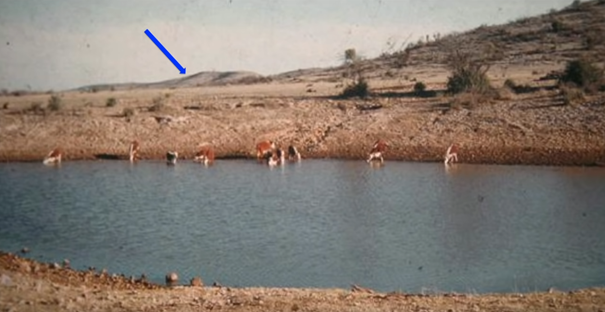
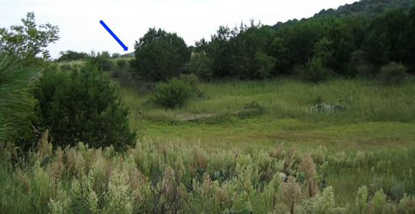
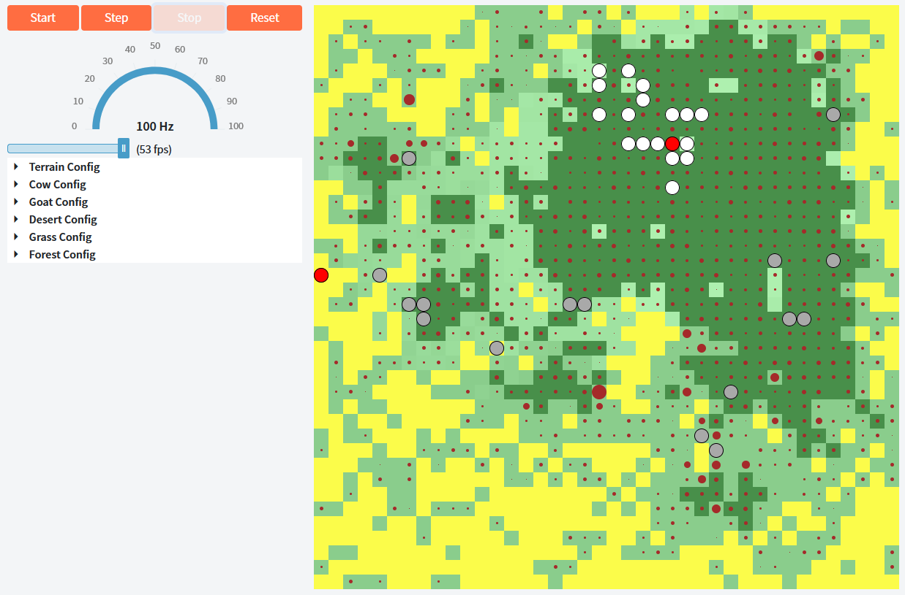

 # Toetsbeschrijving: ICT-DEV-OO-18-ProjectRoseOfSharon

Beroepsproduct: Project Rose of Sharon (grafisch reverse-desertification simulatiemodel) voor module ICT-DEV-OO-18

  - [Introductie](#introductie)
    - [Toetsdeel A](#toetsdeela)
    - [Toetsdeel B](#toetsdeelb)
    - [Toetsdeel C](#toetsdeelc)
  - [Applicatie omschrijving](#applicatieomschrijving)
    - [Context](#context)
    - [Concept](#concept)
    - [Diagrammen](#diagrammen)
    - [Documentatie](#documentatie)
    - [Testen](#testen)
  - [Visual Studio](#visualstudio)
  - [Referenties](#referenties)

   

## Introductie
Het beroepsproduct wordt in drie afzonderlijke toetsdelen aangetoond. Voor deze deelopdrachten werk jij met een applicatie om een reverse-desertification model te simuleren die uiteindelijk zal werken via een (vooraf gegeven) web front-end. De werking van jouw applicatie kan jij uitvoerig testen via de geleverde web front-end.

Zorg dat je op tijd begint met elk toetsdeel. Met de opdrachten van deze toetsdelen demonstreer jij aan ons jouw vaardigheden doordat hierin alle aspecten aan bod komen zoals beschreven in de toetsmatrijs, waarin alle beoordelingscriteria staan uitgewerkt.

Het beroepsproduct bestaat uit drie delen:

- implementeren van imperatieve constructies (**IP programmeren**) in programmeertaal C# (toetsdeel A),
- object-oriented ontwerpen interpreteren en implementeren (**OO ontwerp/design**) (toetsdeel B),
- implementeren van OO concepten in C# (**OO programmeren**) (toetsdeel C).

Het beroepsproduct wordt individueel ingeleverd.

### Toetsdeel A
Dit toetsdeel gaat over de imperatieve constructies bij het programmeren in C#. Bij deze deelopdracht werk jij aan de simulatie van kunstmatige migratiepatronen waarbij dieren onder leiding van een herder die bepaalde wandelstrategieën volgt om de migratie na te bootsen. Om verschillende strategieën met elkaar te kunnen vergelijken ontwikkel jij een eenvoudige utility-class ter ondersteuning van het schrijven van migratiestrategieën en werk jij vervolgens enkele migratiestrategieën uit. Daarnaast lever jij passende unit tests op bij de applicatie. Je kunt aan de slag met dit toetsdeel vanaf lesweek 1.

[Klik hier](README_TOETSDEEL_A.md) om de opdrachtbeschrijving van toetsdeel A te bekijken.

### Toetsdeel B
Dit toetsdeel zal met name gaan over OO ontwerp/design. Bij deze deelopdracht werk jij aan de applicatie door variatie van het terrein mee te nemen in jouw implementatie zodat de effecten van migratiepatronen zichtbaar worden in jouw simulatie. Hiervoor breid jij jouw applicatie uit aan de hand van een aantal ontwerpen die gegeven zijn in UML (use case, class en/of sequence) diagrammen. Het is jouw taak deze diagrammen op een correcte manier te interpreteren en om te zetten naar nette en werkende code.  

Je kunt aan de slag met dit toetsdeel vanaf lesweek 4.

[Klik hier](README_TOETSDEEL_B.md) om de opdrachtbeschrijving van toetsdeel B te bekijken die te vinden is in jouw starter GitHub repository.

### Toetsdeel C
Dit toetsdeel zal met name gaan over OO concepten, die gebruikt worden bij het programmeren in C#. Bij deze deelopdracht werk jij aan het deel van de applicatie dat verantwoordelijk is voor alle levende wezens met name de dieren. Om de applicatie op een juiste manier te implementeren moet jij inmiddels goed bekend zijn met de verschillende OO concepten (zoals inheritance, polymorphism en encapsulation) en eventueel alvast enkele software design patterns. Hierbij bestaat ook de ruimte om meer geavanceerdere onderdelen te implementeren: je kan complexer gedrag, extra dieren implementeren en/of dingen verbeteren aan de front-end. 
 
 Je kunt aan de slag met dit toetsdeel vanaf lesweek 7.
 
 [Klik hier](README_TOETSDEEL_C.md) om de opdrachtbeschrijving van toetsdeel C te bekijken die te vinden is in jouw starter GitHub repository.

## Inleveren
Vóór de deadline (zie ItsLearning) lever jij jouw code in via ItsLearning (samen met de andere toetsonderdelen).

Ingangseis: Jouw applicatie functioneert volgens de aangegeven specificaties.

Om met het programma te werken moet jij de code van starter in een private repository plaatsen. Jij werkt met een IDE zoals Visual Studio 2022 en zorgt dat op zijn minst de volgende onderdelen worden ingeleverd:
- Source code (met jouw uitwerkingen)
- README.md met de volgende inhoud:
  - URL naar je GitHub repository en de branch met de versie die jij wil inleveren.
  - URL van het pull request met jouw oplossing.
  
Let op het principe van plagiaat: Samenwerken aan één probleem, betekent niet dat jij dezelfde oplossing inlevert! Verder is het ontbreken van een toelichting op een gebruikte oplossing reden om een onvoldoende te geven!

Let op de volgende zaken:
- Jij wordt niet beoordeeld op de frontend / opmaak / styling van je applicatie (Blazor, Html, CSS).
- Maak gebruik van Git voor versiebeheer. Commit regelmatig. Wij willen je progressie kunnen zien.
- Maak direct een branch van de versie die je krijgt en werk alleen met branches. Wij willen een pull-request krijgen met al jouw wijzigingen ten opzichte van de versie die je van ons krijgt.

## Applicatie omschrijving: Project Rose of Sharon

In deze opdracht maak jij een grafische reverse-desertification simulator, genaamd `ProjectRoseOfSharon`. Je gaat in deze opdracht werken met een [brownfield applicatie](https://en.wikipedia.org/wiki/Brownfield_%28software_development%29). Dat wil zeggen dat je zult gaat werken met een bestaande applicatie. Een andere developer heeft een nette software architectuur voor jou achtergelaten waar jij verder aan zult gaan werken. Deze developer heeft ervoor gekozen om gebruik te maken van een ASP .NET Web Applicatie geschreven in de programmeertaal C#. De programmeur heeft verder gebruik gemaakt van Blazor om een client web applicatie te kunnen ontwikkelen met templates opgebouwd uit HTML en CSS. Daarnaast heeft de programmeur gebruik gemaakt van NUnit voor het maken van unit tests. Al deze functionaliteiten zijn direct beschikbaar in de solution / het project.

> Bestudeer de solution en probeer alvast globaal te begrijpen hoe de applicatie in elkaar zit.

Onderstaande tekst geeft de beschrijving van de [agent-based](https://en.wikipedia.org/wiki/Agent-based_model)1 simulator. De simulator is een [multi agent systeem](https://nl.wikipedia.org/wiki/Multi-agentsysteem)2 waarin verschillende *agenten* (herders, koeien, schapen, etc.) zelfstandig opereren. Geen enkele agent "heeft een overzicht van het gehele systeem"2. Zo ziet bijvoorbeeld een schaap alleen maar wat in zijn directe omgeving gebeurt. Het schaap ziet de herder alleen wanneer deze zich in het blikveld (Field of view) van het schaap bevindt. De beschreven werking van de verschillende agenten zijn vrij eenvoudig (als je ze vergelijkt met wat meer geavanceerde AIs), maar toch kan het geheel [emergent complex gedrag](https://nl.wikipedia.org/wiki/Emergentie)3 vertonen. Dit betekent dat uit de verzameling van simpele gedragingen, complex gedrag ontstaat. Een leuk voorbeeld hiervan is de [game of life](https://playgameoflife.com/), waarin op basis van 4 hele [simpele regels](https://playgameoflife.com/info) er een soort van herhalende patronen ontstaan.

*Video: Game of life - Klik op het plaatje om de video af te spelen*

> 🐱‍👤 Extra uitdaging: Voor diegene die extra uitdaging zoeken, wordt hier en daar een tip gegegeven voor extra functionaliteit in de toetsdelen. Dit wordt gedaan met behulp van de ninja cat 🐱‍👤. Denk eraan dat de basisopdracht afkrijgen belangrijker is dan de extra uitdagingen voltooien, dus zorg voor de juiste prioriteiten. 

### Context
Wereldwijd is er nog steeds sprake van voedselschaarste in drogere landen. Om dit probleem op te lossen wordt er onder andere onderzoek gedaan naar hoe een woestijn weer naar vruchtbaar land kan worden getransformeerd. Er zijn meerdere projecten die zich hiermee bezig houden en één daarvan is een project waarbij gebruik gemaakt wordt van artificiële migratiepatronen van vee (door het mimieken van natuurlijke migratiepatronen). Door het grazen, vertrappen, poepen en urineren van vee, waarna ze weer migreren naar het volgende stukje land, wordt droog en dor land weer getransformeerd naar vruchtbaar land. Zie voor meer informatie deze video:

*Video: How to green the world's deserts and reverse climate change | Allan Savory*

De (fictieve) organisatie Pandu zet zich sinds 2009 in om door middel van slimme digitale dashboards Keniaanse bedrijven in de agri- en foodsector te helpen. De organisatie is gespecialiseerd in het leveren van modulaire platforms die veelal gebruik maken van IoT (Internet of Things), GIS (Geographic Information Systems), drones en machine learning.

Een klant van Pandu houdt zich bezig met artificiële migratiepatronen van vee om het land vruchtbaarder te maken. Deze klant is benieuwd naar de effecten van dit artificiële migratiepatroon en zouden graag inzicht willen in de werking op hun eigen woestijnachtige gebieden van artificiële migratiepatronen. De klant zou graag de scenario met artificiële migratiepatronen van vee willen vergelijken met de scenario zonder.  

Om deze reden zijn enkele onderzoekers van Pandu bezig gegaan met de reverse-desertification simulator om een [digital twin](https://en.wikipedia.org/wiki/Digital_twin) te maken om zo de effecten van de artificiële migratiepatronen van vee te kunnen bestuderen (zonder jaren te hoeven experimenteren met dieren en kostbare grond). Hiervoor zijn zij begonnen aan de ontwikkeling van de applicatie Project Rose of Sharon. Aangezien de organisatie graag een robuuste applicatie wil, heeft de organisatie Pandu jou gevraagd om deze applicatie verder te gaan ontwikkelen. Een robuuste applicatie kenmerkt zich door kwalitatieve, onderhoudbare, goed gestructuurde, veilige en makkelijk aan te passen code.

### Concept
Om een idee te krijgen van welke resultaten de klanten van Pandu op zitten te wachten is hierbij een "voor" en "na" situatie van hetzelfde stukje land gegeven:

*Figuur: Voor de toepassing van artificiële migratiepatronen*

*Figuur: Na de toepassing van artificiële migratiepatronen*

De applicatie waar jullie aan gaan werken is dus een simulator die probeert te voorspellen hoe verschillende migratiepatronen het land beïnvloeden.

De simulator is niet interactief, maar simuleert de ontwikkeling van terrein door interactie met de volgende levensvormen:

 - Herders (Shepherd)
 - Koeien (Cow)
 - Geiten (Goat)
 
 Deze levensvormen begeven zich op verschillende terreinsoorten (ISpot):
 - Gras (GrassSpot) 
 - Bos (ForestSpot) 

*Figuur: Screenshot simulator - Een paar koeien, geiten en herders op een terrein met woestijn, gras en bos.*

Herders, koeien en geiten zijn levensvormen (`IBiological`) en hebben een plek op het terrein (`ISpot`) en een `Update()` functie waarin het gedrag van het dier beschreven is.

Een `Terrain` bestaat uit een aantal `ISpot`s, waarbij elk `ISpot` een `Position` heeft op dat terrein, dat bestaat uit een `x` en `y` waarde die respectievelijk de horizontale en verticale positie op het terrein aanduidt.   

### Diagrammen

In onderstaande globale klassendiagram zie je hoe de verschillende classes zich tot elkaar verhouden. Je werkt dus met een Brownfield applicatie. In dit klassendiagram zijn geen properties
en ook geen methods opgenomen om het overzichtelijk te houden. Zie de specifieke 
klassesndiagrammen in de verschillende toestdelen voor meer informatie.

*Figuur: Class diagram van de belangrijkste classes en interfaces.*

Met de opdrachten werk jij eraan om deze simulatie werkend te krijgen. Probeer met kleine stappen de simulatie werkend te krijgen. Bestudeer eerst waar alles zit in de applicatie, en te begrijpen hoe de applicatie samenhangt. Begin dan met de implementatie. Houd de stapjes klein en commit je werk vaak. Op deze wijze houd je het werk behapbaar.

*Figuur: Use Case diagram met de belangrijkste functionaliteiten vanuit de gebruiker*

In deze use case diagram zie je de basisfunctionaliteiten van de applicatie voor de gebruiker. 

### Documentatie

De applicatie is voorzien van documentatie bij de verschillende functionaliteiten. In de 
omschrijvingen van de verschillende toestdelen vind je nog meer informatie over de 
functionaliteiten van het programma.

### Testen

Wanneer je nieuwe functionaliteit toevoegt kun je dit testen door de applicatie te ***builden*** en te ***starten***. Er start dan een webapplicatie waarin je je functionaliteit terug kan zien, dit kan ondersteunend werken bij het testen van de applicatie. Met behulp van ***debuggen*** kan je door de code heenlopen om te kijken wat er nou precies gebeurt. 

Het beste, om zeker te weten dat de code doet wat het moet doen, is om telkens wanneer jij een nieuwe methode implementeert de werking hiervan te garanderen en bewaken door het schrijven van ***unit tests***. Zo kan bepaalde functionaliteit niet onopgemerkt omvallen, wanneer je iets ogenschijnlijk onverwants aanpast. Als je jezelf aanleert om unit tests te schrijven voor je code, zul je zien dat je uiteindelijk sneller kan ontwikkelen, dan dat je elke keer de applicatie opnieuw moet opstarten en maar hopen dat de situatie die je wilt testen zich voordoet.

## Visual studio

Jij gaat werken in Visual Studio van Microsoft. Vanuit IP en DT was je gewend te werken met Visual Code en moest je je Golang applicatie zelf builden vanaf de command line. Visual Studio doet dit allemaal voor je. Beter nog, als je de applicatie runt (sneltoets F5), dan wordt de applicatie meteen gebuild en daarna start hij meteen automatisch met debuggen. Ook het runnen/debuggen van tests is geïntegreerd (ga naar menu `Test` en kies voor `Run all tests` / `Debug all tests`).  

De bestandsstructuur is als volgt opgebouwd:

 - `wwwroot` - bestanden die je wilt kunnen gebruiken in de webapplicatie. Deze zijn allemaal direct beschikbaar wanneer vanuit de webbrowser.
 - `Business` - alle domeingerelateerde functionaliteit.
 - `VisualComponents` - de Razor components. In Razor pages maak je dynamische webpagina's door heel makkelijk HTML en code om te combineren.
 - `Config` - alle configs die de parameters bevatten voor je verschillende agents (alsook voor het `Field`), zoals de maximum leeftijd van een dier, diens snelheid alsook hoeveel het kan eten. Deze waarden worden vanuit de webinterface gevuld.
 - `Pages` - de hoofdpaginas zoals de Simulator, maar ook een error pagina
 - `Shared` - de MainLayout bevat de hoofd layout die je in alle `Pages` terug vindt
 - root - de rest van de bestanden zijn voor de algehele opzet en configuratie van de applicatie. Als de applicatie gestart wordt, word `Program.Main()` uitgevoerd. Deze geeft aan `Startup` te gebruiken als startup, waarin de applicatie wordt geconfigureerd. 

## Referenties
1 Agent-gebaseerd model. In Wikipedia. Retrieved April 9, 2021, from https://en.wikipedia.org/wiki/Agent-based_model

2 Multi-agentsysteem. In Wikipedia. Retrieved April 15, 2021, from https://nl.wikipedia.org/wiki/Multi-agentsysteem

3 Emergentie. In Wikipedia. Retrieved April 15, 2021, from https://nl.wikipedia.org/wiki/Emergentie