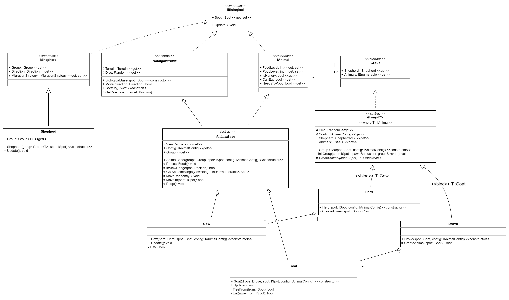

# Toetsdeel C: ICT-DEV-OO-18-ProjectRoseOfSharon

Toetsdeel C: Project Rose of Sharon (grafisch reverse-desertification simulatiemodel) voor module ICT-DEV-OO-18.

 - [Introductie](#introductie)
 - [Inleveren](#inleveren)
 - [Diagrammen en Functionaliteiten](#diagenfunc)
 - [Opdrachten](#opdrachten)
   - [Eindopdracht C.1. De koe](#opdrachtc1)
   - [Eindopdracht C.2. De kudde](#opdrachtc2)
   - [Eindopdracht C.3. De rest](#opdrachtc2)
   - [EXTENDED 🐱‍👤 Eindopdracht C.4. Wees creatief!](#opdrachtc4)
   

## Introductie

Dit is de opdrachtbeschrijving voor toetsdeel C voor het vak Object-Oriented Development. In dit toetsonderdeel ligt de nadruk op het demonstreren van jouw implementatie vaardigheden van een object-oriented concepten.

Vanaf week 7 werk jij aan dit toetsonderdeel. Zorg dat je op tijd begint met dit toetsonderdeel. De opdrachten staan hieronder beschreven. Alle opdrachten werk jij uit. Met deze opdrachten demonstreer jij aan ons jouw vaardigheden doordat hierin alle aspecten aan bod komen zoals beschreven in de toetsmatrijs, waarin alle beoordelingscriteria staan uitgewerkt.

Vóór de deadline (zie ItsLearning) lever jij jouw code in via ItsLearning (samen met de andere toetsonderdelen).

Let op de volgende zaken:
- Jij wordt niet beoordeeld op de frontend / opmaak / styling van je applicatie (Blazor, Html, CSS).
- Maak gebruik van Git voor versiebeheer. Commit regelmatig. Wij willen je progressie kunnen zien.
- Maak direct een branch van de versie die je krijgt en werk alleen met branches. Wij willen een pull-request krijgen met al jouw wijzigingen ten opzichte van de versie die je van ons krijgt.

## Inleveren
Voor inleverdetails aan het eind zie [README.md](README.md) in de github repository. Je kunt daarnaast ook je werk tussentijds inleveren. Zorg hiervoor dat je een pull request aanmaakt, dusdanig dat jouw docenten en mede-studenten jouw werk van commentaar en feedback kunnen voorzien.

# Diagrammen en Functionaliteiten

In onderstaand klassendiagram zie je hoe de klassen zich tot elkaar verhouden
en welke properties, velden en methoden je moet implementeren.

*Figuur: Klassendiagram van de biologicals*

De code voor `IBiological`, `BiologicalBase`, `IShepherd` en `Shepherd` is al 
gegeven. Neem de tijd om naar de documentatie op deze klassen te kijken, alsook die van 
`Terrain`, `Position` en `Utils`. Er zijn daar hele handige methods die je een hoop werk en 
tijd kunnen besparen bij het implementeren van deze opdracht. Placeholder code voor `IGroup`, `IAnimal` en `Group<T>` zijn gegeven, maar deze zijn niet af! Je vind deze placeholders 
in het bestand `IGroup.cs`. Verplaats zelf de code naar de juiste bestanden.

`IAnimal`:
 - `FoodLevel` - Het aantal porties voedsel dat dit dier gegeten en nog niet omgezet is in poep.
 - `PoopLevel` - De hoeveelheid poep dat aanwezig is in de darmen van het dier.
 - `IsHungry` - Of het dier hongerig is (FoodLevel &lt; MinHealthyFoodLevel in config)
 - `CanEat` - Of het dier kan eten is (FoodLevel &lt; MaxFoodLevel in config)
 - `NeedsToPoop` - Of het dier moet poepen (PoopLevel &lt; MinPoopLevelToDefecate in config)

`IGroup`:
 - `Shepherd` - De herder van deze groep.
 - `Animals` - De dieren in deze groep.

`Group<T>`:
 - constructor: creëert de de `Shepherd<T>` en probeert hooguit 20 keer een groep van random tussen de 10 en 40 dieren (= groupSize) te spawnen binnen een radius van ongeveer `Math.Ceiling(Math.Sqrt(groupSize))` (= spawnRadius). Het creëren van de groep gebeurt in `InitGroup()`. Als het na 20 pogingen nog steeds niet gelukt is, gooit de constructor de `CannotPlaceGroupException`.
 - `Dice` - Om random dingen te doen
 - `Config` - de configuratie van deze groep
 - `Shepherd` - de herder van deze groep (let op, deze heeft een ander type dan op de interface)
 - `Animals` - de dieren in deze groep
 - `InitGroup()` - Creëert de dieren van deze groepn en stopt ze in de lijst met `Animals`. De dieren worden random binnen de spawnRadius gecreëerd (op beschikbare plekken). Als niet alle dieren geplaatst kunnen worden, wordt `CannotPlaceGroupException` gegooid. Om de dieren te creëren wordt `CreateAnimal()` gebruikt.
 - `CreateAnimal()` - Creëert het dier van type T.

`Herd`:
 - constructor: creëert de herder en de dieren zoals beschreven bij `Group<T>`.
 - `CreateAnimal()` - Creëert een koe.

`Drove`:
 - constructor: creëert de herder en de dieren zoals beschreven bij `Group<T>`.
 - `CreateAnimal()` - Creëert een geit.

`AnimalBase`:
 - constructor - Creëert de `AnimalBase`.
 - `ViewRange` - De afstand (hemelsbreed) waarbinnen dit dier iets kan waarnemen. De straal van de cirkel van het gezichtsveld (zie config)
 - `Config` - de configuratie van dit dier
 - `Group` - De groep waar dit dier toe behoort.
 - `ProcessFood()` - Als de FoodLevel groter dan 0 is, dan daalt ie met 1 en stijgt de PoopLevel met 1.
 - `InViewRange()` - Geeft 'true' terug als de gegeven positie in de ViewRange is van dit dier, met andere woorden als de afstand van dit dier tot de gegeven positie kleiner of gelijk is aan de ViewRange.
 - `GetSpotsInRange()` - Retourneert alle bestaande punten binnen een straal van viewrange vanaf de position, oplopend gesorteerd op afstand (zie ook `Terrain.GetSpotsInRange()`)
 - `MoveRandomly()` - Beweeg naar een random aangrenzend veld
 - `MoveTo()` - Beweeg naar de gegeven spot
 - `Poop()` - Poep op de huidige spot. De hoeveelheid poep die achtergelaten worden is $PoopLevel * config.PoopCompressionFactor / 100$.

`Cow`:
 - constructor - Creëert een koe
 - `Update()` - Voert het gedrag van de koe uit in de huidige iteratie:
   1. Werk de foodlevel en pooplevel bij (zie `ProcessFood()`).
   2. Als het dier honger heeft, ga dan eten
   3. als het niet hoefte te eten, en de herder is in de buurt:
      1. als de afstand (distance) tot de herder groter is dan 50% van de viewrange, ga dan richting de shepherd
      2. als dat niet het geval was, of de koe kon zich niet bewegen richting de herder (vanwege een obstakel), ga dan maar eten
   4. Als het dier dusverre nog niets gedaan heeft, en de dichtstbijzijnde koe is verder weg dan 30% van de viewrange, ga dan naar die koe toe
   5. Als het dier dusverre nog niets gedaan heeft, en het dier kan op zich wel eten (`CanEat()`), ga dan eten
   6. Als het dier dusverre nog niets gedaan heeft, beweeg dan maar naar een random buur (`MoveRandomly()`)
   7. Als het dier moet poepen, poep!
 - `Eat()` - Elke keer als het dier wil eten (zie `Update()`), roept het deze functie aan:
   1. als de huidige Spot een GrassSpot is en er is Grass aanwezig, eet dan het geconfigureerde aantal porties (`PortionsPerMeal`) en verhoog de foodlevel met het exact gegeten aantal porties (dat minder kan zijn dan dat je wilde eten).
   2. Als je niet kon eten, en de herder is binnen de viewrange, kijk dan voor voedsel in de richting van de shepherd en zet 1 stap in die richting.
   3. Als het dier dusverre nog niets gedaan heeft, kijk dan naar het dichtsbijzijnde bron van voedsel en zet 1 stap in die richting
   4. retourneer of je iets hebt kunnen doen

`Goat`:
 - constructor: Creëert een geit
 - `Update()` - Voert het gedrag van de geit uit in de huidige iteratie:
   1. Werk de foodlevel en pooplevel bij (zie `ProcessFood()`).
   2. Als het dier honger heeft, ga dan eten, maar dan wel bij voorkeur uit de richting van de dichtstbijzijnde koe
   3. Als het niet hoefte te eten en er is een koe te dicht bij (30% van de viewrange), vlucht dan weg van de koe
   4. Als het dier dusverre nog niets gedaan heeft, en het kan eten, ga dan eten
   5. Als het dier dusverre nog niets gedaan heeft, en de herder is binnen de view range, beweeg dan richting de herder
   6. Als het dier dusverre nog niets gedaan heeft, beweeg dan richting de dichtstbijzijnde geit
   7. Als het dier dusverre nog niets gedaan heeft, beweeg dan maar naar een random buur (`MoveRandomly()`)
   8. Als het dier moet poepen, poep!
 - `FleeFrom()` - als het dier moet vluchten (zie `Update()`), beweeg je dan in tegenovergestelde richting van de gegeven spot.
 - `Eat()` - - Elke keer als het dier wil eten (zie `Update()`), roept het deze functie aan:
   1. als de huidige Spot een ForestSpot is en er zijn Branches aanwezig, eet dan het geconfigureerde aantal porties (`PortionsPerMeal`) en verhoog de foodlevel met het exact gegeten aantal porties (dat minder kan zijn dan dat je wilde eten).
   2. Als je niet kon eten, en `awayFrom` is niet null, kijk dan voor voedsel in tegenovergestelde richting van die direction en zet 1 stap in die richting.
   3. Als het dier dusverre nog niets gedaan heeft, kijk dan naar het dichtsbijzijnde bron van voedsel en zet 1 stap in die richting
   4. retourneer of je iets hebt kunnen doen

# Opdrachten
Dit zijn de opdrachten (vergeet niet tests te schrijven!):

## Eindopdracht C.1. De koe

Implementeer aan de hand van de UML (use case, class en sequence) diagrammen en bovenstaande beschrijvingen van de functionaliteiten de koe. Begin niet meteen de volledige implementatie, maar probeer een koe op het veld te krijgen (breid `Terrain.SpawnBiologicals()` uit). Probeer daarna de koe random te laten bewegen. Probeer dan af en toe te eten. Enzovoort. Maak na elke wijziging een commit, zodat je altijd terug kan naar een eerdere versie (en wij kunnen je progressie kunnen zien). Maak in jouw implementatie gebruik van eventuele base classes en interfaces zoals aangegeven in het object-oriented ontwerp.

## Eindopdracht C.2. De kudde

Implementeer aan de hand van de UML (use case, class en sequence) diagrammen en bovenstaande beschrijvingen van de functionaliteiten de kudde. Zorg ervoor dat de kudde met herder en koeien random gespawned worden op het terrein (breid `Terrain.SpawnBiologicals()` uit). 

## Eindopdracht C.3. De rest

Implementeer nu aan de hand van de UML (use case, class en sequence) diagrammen en bovenstaande beschrijvingen van de functionaliteiten de rest. Zorg ervoor dat je net zoals in de vorige opdrachten je incrementeel werkt. Probeert niet alles in een keer werkend te krijgen, maar voeg een beetje toe, test het, schrijf de nodige tests, en commmit.

## EXTENDED 🐱‍👤 Eindopdracht C.3. Wees creatief!

Voeg extra functionaliteiten toe voor een hoger cijfer. Ideeën:
 - Voeg nog een groep dieren toe, die ander gedrag vertonen dan koeien en geiten (🐱‍👤🐱‍👤)
 - Koeien kunnen niet op forest spots komen (🐱‍👤)
 - Voeg een migratie strategie toe op basis van het [A* zoekalgoritme](https://en.wikipedia.org/wiki/A*_search_algorithm) (🐱‍👤🐱‍👤🐱‍👤)
 - Voeg predators toe die op dieren jagen, en waarvoor de dieren vluchten (🐱‍👤🐱‍👤🐱‍👤)
 - zorg ervoor dat dieren niet poepen op spots die al vol met poep liggen (🐱‍👤)
 - ...